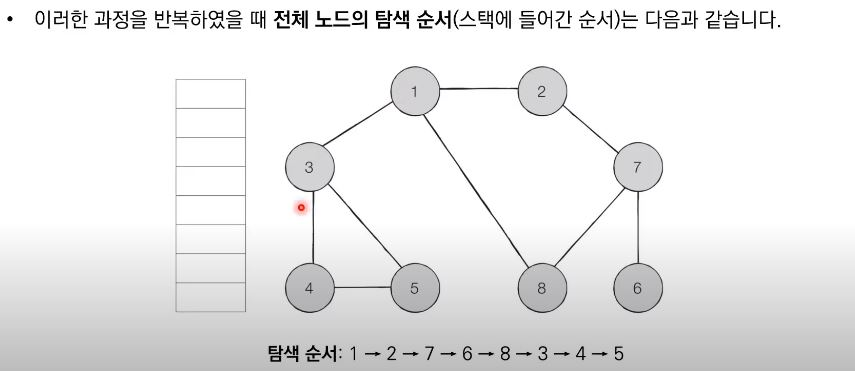
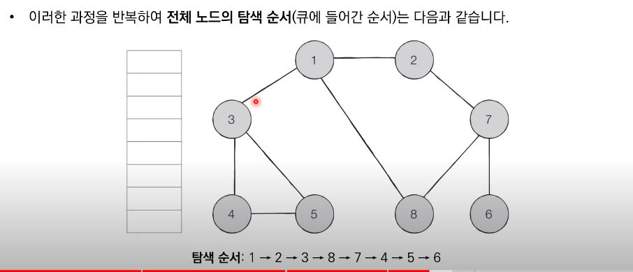

## DFS&BFS
탐색이란 많은 양의 데이터 중에서 원하는 데이터를 찾는 과정
대표적인 그래프 탐색 알고리즘: DFS&BFS

## 스택
자료구조인 스택을 알고있어야 하는 알고리즘
append와 pop으로 구현할 수 있음

## 큐
from collection import deque
#큐 구현을 위해 deque 라이브러리를 사용한다
#시간복잡도가 리스트보다 작기떄문에 덱을 이용해서 구현한다 
queue = deque()

#삽입append, 삭제 popleft
queue.append()
queue.popleft()

#역순으로 바꾸기
queue.reverse()

시간복잡도는 상수시간이다.

## 재귀함수
자기 자신을 다시 호출하는 함수이다

ex1)
def recursive_function():
  print('재귀함수를 호출합니다')
  recursive_function()

#별다른 설정없이 돌리면 최대재귀깊이가 초과된다는 메세지가 나온다
recursive_function()

ex2)
def recursive_function(i):
  if i == 100:
    return 
  print(i, '번째 재귀함수에서', i+1, '번째 재귀함수를 호출합니다')
  recursive_function(i+1)
  print(i, '번째 재귀함수를 종료합니다')

recursive_function(1)]

ex3) 팩토리얼 예제
def factorial_recursive(i):
  if n <>= 1:
    return 1 
  return n * factorial_recursive(n - 1)

## 최대공약수 계산 유클리드 호제법 
두개의 자연수 A,B가 있을 때, a를 b로 나눈 나머지를 R이라고 한다면,
A와 B의 최대공약수는 B와 R의 최대공약수와 같다
이것을 유클리드 호제법을 이용하여 재귀함수로 구현할 수 있음

### 코드
def gcd(a,b):
  if a % b == 0:
    return b
  else:
    return gcd(b, a % b) #B와 R의 최대공약수

print(gcd(192,163)) #6

## 재귀함수 사용 시 유의사항
잘 활용하면 간곃하게 작성이 가능하지만 가독성이 떨어지는 코드가 될 수 있음 재귀함수는 반복문을 이용하여 구현가능
컴퓨터가 함수를 연속적으로 호출하면 컴퓨터 메모리 내부의 스택 프레임에 쌓인다 그래서 스택을 이용하여 구현할 때 스택 라이브러리 대신에 재귀함수를 이용하는 경우가 많다

## DFS
깊이 우선 탐색이라고 하고 깊은 부분을 우선적으로 탐색하는 알고리즘

스택 자료구조 혹은 재귀함수를 이용하며 구체적인 동작 과정은 다음과 같다

1. 탐색 시작 노드를 스택에 삽입하고 방문 처리를 합니다.
2. 스택의 최상단 노드에 방문하지않은 인접한 노드가 하나라도 있으면 그 노드를 스택에 넣고 처리한다. 방문한 노드가 없으면 스택에서 최상단 노드를 꺼낸다.
3. 더이상 2번의 과정을 수행할 수 없을 때까지 반복한다

## DFS 동작예시

1에서 출발했다가 오른쪽 맨끝까지 닿으면 다시 1로 돌아왔다가 왼쪽 끝까지 갔다가 다시 1로 돌아오는 형태

## 코드
#DFS 메서드 정의
def dfs(graph, v, visited):
  #현재노드를 방문처리
  visited[v] = True
  print(v, end=' ')
  #현재 노드와 연결된 다른 노드를 재귀적으로 방문
  for i in graph[v]:
    if not visited[i]:
      dfs(graph, i, visited)

#인접리스트 방식으로 그래프를 표현함(1번 노드에 인접한 노드랄 1번 인덱스에 작성)
graph = [[],[2,3,8],[1,7],[1,4,5],[3,5],[3,4],[7],[2,6,8],[1,7]]

#각 노드가 방문된 정보를 표현(1차원 리스트)
visited = [False] * 9

dfs(graph, 1, visited)
 

## BFS(Breadth-First Search)
너비 우선탐색으로 그래프에서 가까운 노드부터 우선적으로 탐색하는 알고리즘
큐 자료구조를 이용하며 구체적인 동작은 다음과 같다
1. 탐색 시작 노드를 큐에 삽입하고 방문 처리를 한다.
2. 큐에서 노드를 꺼낸 뒤에 해당 노드의 인접 노드 중에서 방문하지 않은 노드를 모두 큐에 삽입하고 방문 처리합니다.
3. 더 이상 2번의 과정을 수행할 필요가 없을 때까지 반복합니다.

## BFS 동작원리

1번부터 방문처리하고 인접 노드인 2,3,8을 큐에 삽입한다 2부터 꺼내서 주변 인접 노드를 확인하면 1, 7이고 아직 7을 방문하지 않았으니 7을 큐에 삽입하고 방문처리한다 이제 3을 큐에서 꺼내서 인접노드를 확인한다 4,5 둘다 방문하지 않았으니 큐에 넣고 방문처리한다 이걸 방문 처리가 모두 끝날때 까지 반복한다

## 코드
from collections import deque
#BFS 메서드 정의
def bfs(graph, start, visited):
  # 큐 구현을 위해 deque 라이브러리 사용
  queue = deque([start])
  #현재 노드를 방문처리
  visited[start] = True 
  #큐가 빌때까지 반복
  while queue:
    #큐에서 하나의 원소를 뽑아 출력하기
    v = queue.popleft()
    print(v, end=' ')
    #아직 방문하지 않은 인접한 원소들을 큐에 삽입 
    for i in graph[v]:
      if not visited[i]:
        queue.append(i)
        visited[i] = True
  
graph = [[],[2,3,8],[1,7],[1,4,5],[3,5],[3,4],[7],[2,6,8],[1,7]]

#각 노드가 방문된 정보를 표현(1차원 리스트)
visited = [False] * 9

bfs(graph, 1, visited)

### 문제: 음료수 얼려멱기
N X M크기의 얼음 틀, 구멍이 뚫린 부분은 0, 칸막이가 존재하는 부분은 1로 표시, 구멍이 뚫린 부분끼리 상하좌우로 붙어있는 경우 서로 연결되어 있는 것으로 간주 이때 얼음 틀의 모양이 주어졋을 때 생성되는 총 아이스크림 개수를 구하는 프로그램을 작성하시오 다음의 4X5 얼음 틀 예시에서는 아이스크림이 총 3개가 생성됩니다

### 해결 아이디어
1. 특정한 지점의 주변 상하좌우를 살펴본 뒤에 주변 지점 중애서 값리 0이면서 아직 방문하지 않은 지점이 있다면 해당 지점을 방문
2. 방문한 지점에서 다시 상하좌우를 살펴보며 방문을 진행하는 과정을 진행하는 과정을 반복한다면 연결된 모든 지점을 방문할 수 있다
3. 모든 노드에 대하여 1~2를 반복하며 방문하지 않은 지점의 수를 카운트다운한다

### 코드

### 문제: 미로탈출
동빈이는 N X M크기의 직사각형 미로에 갇혔습니다. 미로에는 여러 마리의 괴물이 있어서 피해서 탈출해야한다
동빈이의 위치는 (1,1)이며 미로의 출구는 (N,M)의 위치에 존재하며 한번에 한 킨씩 이동할 수 있다. 이때 괴물이 있는 부분은 0으로, 괴물이 없는 부분은 1로 표시되어 있다. 미로는 반드시 탈출할 수 있는 형태로 제시된다.
이때 동빈이가 탈춯하기 위해 움직여야하는 최소 칸의 개수를 구하세요. 칸을 셀 때는 시작 칸과 마지막 칸을 모두 포함해서 계산합니다.(시작칸과 마지막칸은 항상 1이다.)

문제 조건: 1초/ 128MB/ 최대 40000칸

### 해결 아이디어
괴물이 있는 0은 가면 안되고 1로만 움직여야 함
최단거리로 이동하려면 아래로 먼저 가야하는데 아래가 없거나 0인 경우에는 오른쪽으로 이동하면 최단거리로 이동할 수 있음

BFS 시작지점에서 가까운 노드부터 차례대로 그래프의 모든 노드를 탐색합니다 상하좌우 연결된 모든 노드로의 거리가 1로 동일하다.
따라서 (1,1) 지점부터 BFS를 수행하여 모든 노드의 최단거리 값을 기록하면 해결할 수 있다.

시작위치에서 이동할 때마다 해당 노드에 1씩 더해서 최단거리를 구할 수 있도록 코드를 짠다

### 코드

