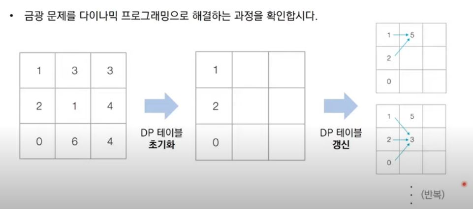

### 다이나믹 프로그래밍

메모리를 적절히 사용하여 수행시간 효율성을 비약적으로 향상시키는 방법
이미 계산된 결과는 별도의 메모리 영역에 저장하여 다시 계산하지 않도록 한다
DP는 탑다운(하향식)과 바텀업(상향식) 두가지 방식으로 구성된다

DP는 동적계획법이라고도 부른다
일반적인 프로그래밍 분야에서의 동적이란 의미는?
 -  자료구조에서 동적할당(Dynamic allocate)은 '프로그램이 실행되는 도중에 실행에 필요한 메모리를 할당하는 기법'
 - 반면에 다이나믹 프로그래밍에서의 다이나믹은 별다른 의미없다

다이나믹 프로그래밍은 문제가 다음 조건을 만족할 때 사용할 수 있다
1. 최적 부분 구조(optimal substructure): 큰 문제를 작은 문제로 나눌 수 있으며 작은 문제의 답을 모아서 큰 문제를 해결할 수 있다
2. 중복되는 문제(overlapping subproblem): 동일한 작은 문제를 반복적으로 해결해야한다

#### 대표적인 문제: 피보나치 수열
1,1,2,3,5,8,13,21,34,55,89,...(각각의 항이 앞의 두가지의 합인 것)
점화식이란 인접한 항들 사이의 관계식을 의미한다 => 점화식으로 표현할 수 있는 것들은 재귀식으로 간단하게 표현이 가능하다
피보나치 수열을 점화식으로 표현하면 다음과 같다
an = an-1 + an-2, a1 = 1, a2 = 1

프로그래밍에서는 이러한 수열(sequence)을 배열이나 리스트를 이용해 표현한다
배열이나 리스트를 테이블이라고도 한다

피보나치 수열의 시간 복잡도 분석
단순 재귀함수로 피보나치 수열을 해결하면 지수 시간 복잡도를 가지게 된다
동일한 부분 문제가 반복적으로 발생한다는 것을 알 수 있다
그래서 시간 복잡도를 줄이기 위해서 DP를 이용하게 되는 것이다

#### 메모이제이션
다이나믹 프로그래밍을 구현하는 방법 중 하나이다
한번 계산한 결과를 메모리 공간에 메모하는 기법
같은 문제를 다시 호출하면 메모했던 결과를 그대로 가져온다
값을 그대로 기록해 놓는다는 점에서 캐싱이라고도 한다

#### 탑다운 vs 바텀업
탑다운(메모이제이션) 방식은 하향식이라고도 하며 바텀업 방식을 상향식이라고도 한다
DP 전형적인 형태는 바텀업 방식이다
결과 저장용 리스트는 DP 테이블이라고도 부른다
엄밀히 말하면 메모이제이션은 이전에 계산된 결과를 일시적으로 기록해 놓는 넓은 개념을 의미한다
따라서 메모이제이션은 DP에 국한된 개념은 아니다(한번 구해진 결과를 담기만 하면 메모이제이션을 했다거나 해시를 했다고 말할 수 있기 때문이다)
한 번 계산된 결과를 담아 놓기만 하고 DP위해서 활용하지 않을 수도 있다(즉, 메모이제이션과 DP는 다른 개념이라고 할 수 있다)

- 피보나치 수열 탑다운
#한번 계산한 결과를 메모이제이션하기 위한 리스트 초기화
d = [0] * 100

#피보나치 함수를 재귀함수로 구현(탑다운 DP)
def fibo:
  if x == 1 or x == 2 :
    return 1
  #이미 계산한 적 있는 문제라면 그대로 반환
  if d[x] != 0:
    return d[x]
  #아직 계산하지 않은 문제라면 점화식에 따라서 피보나치 결과 반환
  d[x] = fibo(x - 1) + fibo(x - 2)
  return d[x]

print(fibo(99))

__메모이제이션을 사용하면 피보나치 수열 함수의 시간 복잡도는 O(N), 상수시간이다__

- 피보나치 수열 바텀업
#앞서 계산한 결과를 저장하기 위한 DP 테이블 초기화

#첫번째 피보나치 수와 두 번재 피보나치 수는 1
d[1] = 1
d[2] = 1
n = 99

#피보나치 함수 반복문으로 구현(바텀업 DP)
for i in range(3, n + 1):
  d[i] = d[i - 1] + d[i - 2]

print(d[n])

#### DP VS 분할정복
둘다 최적부분구조를 가질때 사용할 수 있지만 둘의 차이는 부분 문제의 중복이다
DP에서는 각 부분의 문제들이 서로 영향을 미치면 부분 문제가 중복되는 반면 분할 정복은 중복되지 않는다

예) 분할 정복의 대표적인 예시인 퀵 정렬을 보자
한 번 기준원소(pivot)가 자리를 변경해서 자리를 잡으면 그 기준 원소의 위치는 바뀌지 않는다
분할 이후에 해당 피벗을 다시 처리하는 부분 문제는 호출하지 않는다

#### 다이나믹 프로그래밍에 접근하는 방법
주어진 문제가 DP유형인지를 파악하는 것이 중요
가장 먼저 그리디, 구현, 완전탐색 등의 아이디어로 문제를 해결할 수 있는 지 검토할 수 있다
다른 알고리즘 풀이 방법이 떠오르지 않는다면 DP를 고려해보자
일단 재귀함수로 비효율적인 완전탐색 프로그램을 작성한 뒤에(탑다운) 작은 문제에서 구한 답이 큰 문제에서 그대로 사용될 수 있으면, 코드를 개선하는 방법을 사용할 수 있다
일반적인 코테에서는 기본 유형의 DP가 출제되는 경우가 많다(점화식을 찾는 것이 어렵기 때문에 자주 출제되는 문제가 나오는 편이라고 한다)

#### 문제: 개미전사
개미전사는 식량을 약탈하기 위해서 메뚜기창고를 공격하기로 했다
메뚜기 창고는 일직선으로 이어져 있고 안에는 정해진 수의 식량이 저장되어 있다
메뚜기 정찰병에게 들키지 않으려면 일직선상에 존재하는 식량 창고 중에 서로 인접한 식량창고가 공격하면 안되서 최소한 한 칸 이상 떨어진 곳을 공격해야한다
이때 개미가 가장 많은 식량을 얻을 수 있는 최댓값을 구하는 프로그램을 작성하시오

##### 문제해결 아이디어

i-1까지 식량창고를 털면 i번째 식량창고를 털수없고 i-2까지 털면 i를 털 수 있다 
ai = i번째 식량창소까지의 최적의 해(얻을 수 있는 식량의 최댓값)
ki = i번째 식량창고에 있는 식량의 양

따라서, 점화식을 써보면, ai = max(ai-1, ai-2 + ki)

한칸 이상 떨어진 곳은 털 수 있으니까 i-3 이하는 고려할 필요가 없다

#### 문제: 1로 만들기

정수 x가 주어졌을 때, 정수 x에 사용할 수 있는 연산은 다음과 같이 4가지 입니다 
1. x가 5로 나누어 떨어지면, 5로 나눕니다
2. x가 3으로 나누어 떨어지면, 3으로 나눕니다
3. x가 2로 나누어 떨어지면, 2로 나눕니다
4. x에서 1을 뺍니다

정수 x가 주어졌을 때, 연산 4개를 적절히 사용해서 값을 1로 만들고자 합니다. 연산을 사용하는 횟수의 최솟값을 출력하세요, 예를 들어 정수가 26이면 다음과 같이 계산해서 3번의 연산이 최솟값입니다.
26 -> 25 -> 5 -> 1

##### 문제해결 아이디어
정수x에서 바로 나누기를 하면 최단으로 해결할 수 있으므로 나누어보고 안나누어지면 1을빼서 나누어떨어지는지 확인하고 반복해서 1이되면 cnt를 반환

하는 방식의 그리디 해법은 이 문제에서는 사용할 수 없다
나누는 것보다 1을 빼는 게 더 빨리 수를 줄일 수 있기 때문이다
그래서 점화식을 이용해서 DP로 풀어야하는 문제이다

ai = i를 1로 만들기 위한 최소 연산 횟수의 점화식은 다음과 같다
ai = min(ai-1, ai/2, ai/3, ai/5) + 1

#### 문제: 효율적인 화폐 구성
N가지 종류의 화폐가 있습니다. 이 화폐들의 개수를 최소한으로 이용해서 그 가치의 합이 M원이 되도록 하려고 합니다. 이때 각 종류의 화폐는 몇 개라도 사용할 수 있습니다.

예를 들어, 2원, 3원 단위의 화폐가 있을때는 15원을 만들기 위해 3원을 5개 사용하는 것이 가장 최소한의 화폐 개수입니다.

M원을 만들기 위한 최소한의 화폐 개수를 출력하는 프로그램을 작성하세요.

##### 해결 아이디어
가장 큰 가치의 화폐를 사용하여 만들 수 있는 금액인지 만들 수 있다면 얼마까지 만들 수 있는지 나머지 금액이 있다면 그 다음 가치로 만들 수 있는 지 나머지가 있디면 만들 수 없으니까 -1을 반환한다

작은 화폐를 더해서 최종 금액에 도달해야하니까 최소 충족,
여러 금액을 반복적으로 계산하니까 반복도 충족

#### 금광: 문제 조건
n X m 크기의 금광이 있다. 금광은 1 X 1 크기의 칸으로 나누어져 있으며, 각 칸은 특정한 크기의 금이 들어있다.
채굴자는 첫번째 열부터 금을 캐서 맨 처음에는 첫번째 열의 어느 행에서든 출발할 수 있다. 이후에 m-1번에 걸쳐서 매번 오른쪽 위, 오른쪽, 오른쪽 아래 3가지 중 하나의 위치로 이동해야한다. 결과적으로 채굴자가 얻을 수 있는 금의 최대 크기를 출력하는 프로그램을 작성하시오.

##### 문제 해결 아이디어

#### 병사 배치하기: 문제 설명
N명의 병사가 무작위로 나열되어 있다, 각 병사는 특정한 값의 전투력을 보유하고 있다. 벼ㅕㅇ사를 배치할 때는 정투력이 높은 병사가 앞쪽에 오도록 내림차순으로 배치하고자 한다. 앞쪽에 있는 병사의 전투력이 항상 뒤쪽에 있는 병사보다 높아야 한다. 또한 배치과정에서 특정한 위치에 있는 병사를 열외시키는 방법을 이용한다. 그러면서도 남아있는 병사의 수가 최대가 되도록 하고싶다.
 

 
