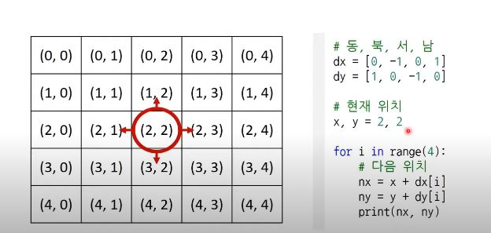

# 그리디 알고리즘 10/04

## 지주 출제되는 문제

### 거스름돈 문제
카운터에서 사용하는 동전은 500,100,50,10,원일 때 손님에게 거슬러줘야할 돈 N원일 때 거슬러줘야할 동전의 최소 개수를 구하시오 거슬러줘야할 돈 N은 항상 10의 배수이다

### 해결 아이디어: 최대금액의 동전부터 거슬러주고나서 나머지의 동전으로 거슬러주면된다
동전이 다들 배수이므로 최대 금액부터 거슬러줘도 최적의 해를 구할 수 잇는 것이다(최적의 해를 구할 수 있는 정당성)

### ex
n=1260원, 500 2개, 100 2개, 50 1개, 10 1개

### 코드
n = 1260
count = 0
array = [500,100,50,10]

for coin in array:
  count += n // coin # 해당 화폐를 거슬러 줄 수 있는 동전의 개수
  n %= coin

print(count)

시간의 복잡도 화폐의 개수로 금액과는 무관하면 동전의 종류에만 영향받음

### 1이 될때까지
어떠한 수 N이 1이될때까지 두개의 과정 중 하나를 수행하여 결국에는 N이 1이되는 최적의 과정의 개수를 구하시오
1. N - 1
2. N // K

### 코드
n = 25 
k= 5
count = 0

while n > 1:
  if n % k == 0:
    n = n // k 
    count += 1
  elif  n % k != 0:
    n = n - 1
    count += 1

print(count)

### 곱하기 혹은 더하기
각 자리 숫자가 0부터 9로만 이루어진 문자열 s가 주어졌을때,왼쪽부터 오른쪽으로 연산을 진행할때 가장 큰 수를 구하시오
하지만 일반계산 방식과는 달리 왼쪽에서부터 연산을 진행함
만들어질 수 있는 가장 큰 수는 20억 이하의 정수이다

### 해결 아이디어
0이 아닌 수라면 곱하기가 유리하고 0이라면 무조건 더해야함
* 내가 생각하지 못한 부분: 1이어도 곱하면 제자리 수니까 더하기가 더 유리함

### 코드
data = input() # 첫 번째 문자를 숫자로 변경하여 대입 
result = int(data[0]) 
for i in range(1, len(data)): # 두 수 중에서 하나라도 '0' 혹은 '1'인 경우, 곱하기보다는 더하기 수행 
  num = int(data[i]) 
  if num <= 1 or result <= 1: 
    result += num 
  else: 
    result *= num 
    
print(result)

### 모험가 길드 문제
한 마을에 모험가 N명 , 모험가 대상으로 공포도를 측정했는데 높은 모험가는 쉽게 공포를 느끼므로 위험 상황에서 대처능력이 미미
모험가 장은 모험가 그룸을 공포도 X인 모험가를 반드시 X명 이상 포함해서 모험가 그룹을 만든다
이렇게 최대 몇개의 모험가 그룹을 만들 수 있는지 구해라
N명의 모험가가 주어졌을 때, 그룹의 최대수를 구하여라
(몇명의 모험가는 마을에 남아있어도 된다)

# 구현(implementation) 
- 머릿속에 있는 알고리즘을 소스코드로 바꾸는 과정
- problem -> think -> solution

- 알고리즘에서 구현 문제란, 풀이를 떠올리는 것을 쉽지만 소스코드로 옮기기 어려운 문제를 지칭

- 구현 유형의 예시(1,2가 많이 출제되는 편)
1. 알고리즘은 간단한제 코드가 지나칠 만큼 길어지는 문제
2. 실수 연산을 다루고, 특전 소수점 자리까지 출력해야 하는 문제
3. 문자열을 특정한 기준에 따라서 끊어 처리해야하는 문제
4. 적절한 라이브러리를 찾아서 사용해야하는 문제(순열, 조합 라이브러리 모르면 코드가 방대해지니까)

- 일반 알고리즘 문제에서는 2차원 공간은 행렬(matrix)의 의미로 사용한다(파이썬에서 2차원 리스트와 동일한 개념)

- 시뮬레이션 및 완전탐색 문제에서는 2차원 공간에서의 방향 백터가 자주 활용된다

### 대표적인 구현 문제 상항좌우 문제
- 시간제한 2초 메모리 제한 128MB
- 문제: 여행가 A는 N x N 크기이 정사각형 공간위에 서 있다 이공간은 1 X 1 크기의 정사각현으로 나누어져있다, 가장 왼쪽 우;는 (1,1)이며 가장 오른쪽 아래 좌표는 (N,N)이다. 여행가 A는 상하좌우 방향으로 이동할  수 있으면 시작죄표는 항상 (1,1)이다. 우리 앞에는 여행가 A가 이동할 계획이 적힌 계획서가 놓여있다.
계획서에는 하나의 줄에 띄어쓰기를 기준으로 하여 LRUD 중 하나의 문자가 반복적으로 적혀있다. 각 문자의 의미는 다음과 같다
L:왼쪽으로 한칸 이동 R: 오른쪽으로 한 칸 이동 U: 위로 한 칸 이동 D: 아래로 한 칸 이동

조건: N X N의 크기의 공간을 벗어나는 움직임은 무시 후 계속 이동한다.

### 해결 아이디어
- 나: 각각의 조건에 만족하면 이동할 수 있도록
- 선생님: 요구사항대로 충실하면 되는 문제, 명령에 떠러소 개체를 차례로 이동시킨다는 점이 시뮬레이션 유형으로도 분류가되며 구현이 중요한 대표적인 문제
코테에서 시뮬레이션 유형, 구현 유형, 완전탐색 유형은 서로 유사한 점이 많다는 것을 기억할 것

### 코드
n = int(input()) # 5
plans = input().split() # R R R U D D
X, y = 1 # 현재 x, y

#U,R,U,D에 따른 이동 방향
dx = [0,0,-1,1]
dy = [-1,1,0,0]
move_types = ['L','R','U','D']

#이동계획을 하나씩 확인하기
for plan in plans:
  #이동 후 좌표구하기
  for i in range(len(move_types)):
    if plan == move_types[i]:
      nx = x + dx[i]
      ny = y + dy[i]
  #공간을 벗어나는 (1,1)~ (n,n)범위를 벗어나면 무시
  if nx < 1 or ny < 1 or nx > n or ny > n:
    continue
  #이동수행
  x, y = nx, ny

print(x, y)

