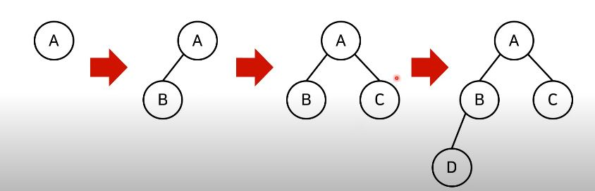
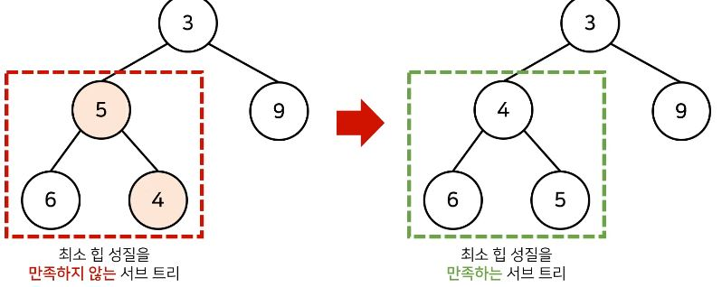

### 우선순위 큐
우선순위 큐는 우선순위가 가장 높은 데이터를 가장 먼저 삭제하는 자료구조이다.
우선순위 큐를 데이터를 우선순위에 따라 처리하고 싶을때 사용한다.
예시) 물건 데이터를 자료구조에 넣었다가 가치가 높은 물건부터 꺼내서 확인하는 경우

### 자료구조와 추출되는 데이터
스택: 가장 나중에 삽입되는 데이터
큐: 가장 먼저 삽입된 데이터
우선순위 큐: 가장 우선순위가 높은 데이터

우선순위 큐를 구현하는 방법 
1) 단순히 리스트를 이용하여 구현
2) 힙을 이용하여 구현

데이터의 개수가 N개일 때 구현 방식에 따라서 시간 복잡도를 비교한 내용은 다음과 같다(최악의 경우)

|우선순위큐 구현방식|삽입시간|삭제시간|
|------|---|---|
|리스트|O(1)|O(N)|
|힙|O(logN)|O(logN)|

단순히 N개의 데이터를 힙에 넣었다가 모두 꺼내는 작업은 정렬과 동일하다(힙 정렬) 이 경우, 시간복잡도는 로그선형시간이다

### 힙의 특징
힙은 완전 이진 트리의 자료구조의 일종
힙에서는 항상 루트노드를 제거합니다

최소 힙: 루트노드가 가장 작은 값을 가진다
따라서 값이 작은 데이터가 우선적으로 제거된다

최대 힙: 루트노드가 가장 큰 값을 가진다
따라서 값이 큰 데이터가 우선적으로 제거된다

완전이진트리: 루트노드부터 시작하여 왼쪽 자식 노드, 오른쪽 자식 노드 순서대로 데이터가 차례로 삽입되는 트리

최소힙 구성함수: Min-Heapify()
(상향식)부모노드로 올라가며, 부모보다 자신의 값이 더 작은 경우에 위치를 교체한다

힙에 새로운 원소가 삽입되었을 때, 전체 데이터 N개이면, O(logN)의 시간복잡도로 힙 성질을 유지하도록 할 수 있다.

힙에서 원소가 제거될 때, O(logN)의 시간복잡도로 힙 성질을 유지하도록 할 수 있다. 원소를 제거할때는 가장 마지막 노드가 루트 노드의 위치에 오게한다(삭제는 루트노드를!) 그리고 다시 힙 성질을 유지하도록 루트노드에서부터 하향식으로 Heapify()를 진행한다

### 우선순위 큐 라이브러리를 활용한 힙 정렬 구현 예제
import sys
import heapq
input = sys.stdin.readline

def heapsort(iterable):
  h=[]
  result=[]
  #모든 원소를 차례대로 힙에 삽입
  for value in lterable:
    heapq.heappush(h, value)
    # 힙에 삽입된 모든 원소를 차례대로 꺼내어 담기
    for i in range(len(h)):
      result.append(heapq.heappop(h))
    return result

n = int(input())
arr=[]

for i in range(n):
  arr.append(int(input()))

res = heapsort(arr)

for i in range(n):
  print(res[i])

#파이썬에서 기본적으로 min-heapify로 동작하기 때문에 오름차순 정렬이 되는 형태이다. 