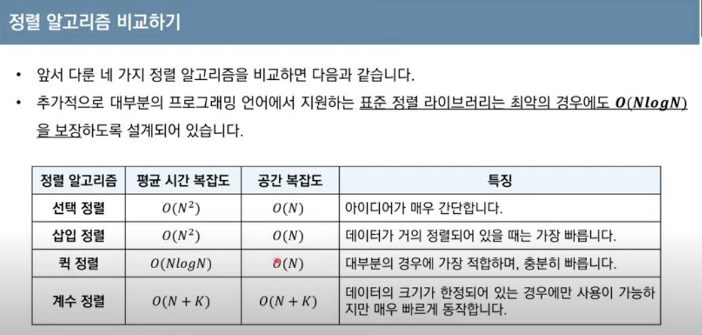

# 10/13

## 정렬
데이터를 특정한 기준에 따라 순서대로 나열하는 것
일반적으로 문제에 따라서 적절한 정렬 알고리즘이 공식처럼 사용된다.

## 정렬의 종류
### 선택정렬
처리되지 않은 데이터 중에서 가장 작은 데이터를 선택해서 맨 앞에있는 데이터와 바꾸는 것을 반복해서 정렬을 완료한다

매번 작은 수를 찾아야하기 때문에 이중 반복문을 이용해서 선형으로 구해야한다는 특징이 있다

#### 선택정렬 코드
array = [7,5,9,0,3,2,6,2,4,8]
for i in range(len(array)):
  min_index = i # 가장 작은 원소의 인덱스
  for j in range(i+1, len(array)): #선형탐색(가장 작은 원소찾을 때까지 for문이 돌아가니까 가장 작은 원소를 찾으면 for문에서 벗어나는 원리임!)
    if array[min_index] > array[j]:
      min_index = j
  array[i], array[min_index] = array[min_index], array[j] # 스와프

print(array) # [0,1,2,3,4,5,6,7,8,9]

#### 선택정렬의 시간 복잡도
N번만큼 가장 작은 수를 찾아서 맨 앞으로 보낸다
구현 방식에 따라서 다를 수 있지만 전체 연산 횟수는 다음과 같다
N + (N-1) + (N-2) + ... + 2 
이는 (N**2 + N - 2) / 2로도 표현할 수 있는 데 빅오 표기법에 따라서 O(N**2)라고 작성한다.

### 삽입정렬
처리되지 않은 데이터를 하나씩 골라 적절한 위치에 삽입한다
선택정렬보다 구현 난이도가 높지만 선택정렬에 비해 빠르게 동작함

왼쪽 데이터와 비교해서(왼쪽 데이터보다 커질때까지) 왼쪽보다 작으면 위치를 바꾸고 더 크면 그자리에 머물게 한다(왼쪽 데이터와 다 비교해서 가장 작으면 맨 앞까지 바꾼다)

#### 삽입정렬 코드
array = [7,5,9,0,3,1,6,2,4,8]

for i in range(1, len(array)):
  for j in range(i, 0, -1): # 인덱스 1부터 i까지 1씩 감소하며 반복하는 문법
    if array[j] < array[j-1]: #한칸씩 왼쪽으로 이동
      array[j], array[j-1] = array[j-1], array[j]
    else: # 자기보다 작은 데이터를 만나면 그 위치에서 멈춤
      break

print(array) # [0,1,2,3,4,5,6,7,8,9]

#### 삽입정렬의 시간 복잡도
O(N**2) 반복문이 두번 중첩되어 사용된다
삽입정렬은 현재 리스트의 데이터가 거의 정렬되어 잇는 상태라면 매우 빠르게 동작한다(최선의 경우에 O(N)의 시간복잡도를 가진다 정렬되어있는 경우에는 그자리에서 멈추기 때문에 상수시간으로 정렬이 되기떄문이라고...)

### 퀵정렬
기준 데이터를 설정하고 그 기준보다 큰 데이터와 작은 데이터의 위치를 바꾸는 방법입니다.
일반적인 상황에서 가장 많이 사용되는 정렬알고리즘 중 하나이다.
변합 정렬과 더불어 대부분으 프로그래밍 언어의 정렬 라이브러리릐 근간이 되는 알고리즘
가장 기본적인 퀵 정렬은 첫번재 데이터를 기준 데이터(pivot)로 설정한다

첫번째 원소를 pivot으로 설정하고  왼쪽에서는 pivot보다 큰값을, 오른쪽에서는 pivot보다 작은 값을 찾아서 선택한다 그리고 두 데이터의 위치를 변경한다 그리고 앞으로 한칸씩 이동해서 똑같이 pivot을 기준으로 선택해서 바꾸고 계속 진행하다가 선택되는 위치가 엇갈리는 경우에는 작은 수와 pivot의 위치를 바꿔서 정렬을 완료한다

특징: pivot왼쪽으로는 pivot보다 작은 데이터가 오른쪽은 pivot보다 큰 값으로 나누어져서 분할(divide) 작업이라고 한다

#### 퀵정렬이 빠른 이유?
이상적인 경우 분할이 절반씩 일어난다면 전체 연산 횟수가 O(NlogN)를 기대할 수 있기 때문이다

최악의 경우 O(N**2) 시간복잡도를 가질 수도 있다. (이미 오름차순으로 정렬된 경우 오른쪽으로만 분할이 치우쳐서 선형탐색이 이루어지므로 최악의 경우가 된다고...)

#### 퀵정렬의 코드
array = [7,5,9,0,3,1,6,2,4,8]

def quick_sort(array, start, end):
  if start >= end: #원소가 한개인 경우 종료
    return 
  pivot = start
  left = start + 1
  right = end
  while(left <= right):
    #피벗보다 큰 데이터를 찾을 때까지 반복(선형탐색)
    while(left <= end and array[left] <= array[pivot]):
      left += 1 
    while(right > start and array[right] >= array[pivot]):
      right += 1 
    if(left > right): # 엇갈렸다면 작은 데이터와 피벗을 교체
      array[right], array[pivot] = array[pivot], array[right]
    else: #엇갈리지 않았다면 작은 데이터와 큰 데이터를 교체
       array[left], array[right] = array[right], array[left]
  #분할 이후로 왼쪽부분과 오른쪽 부분에서 각각 정렬 수행
  quick_sort(array, start, right -1)
  quick_sort(array, right+1, end)

quick_sort(array, 0, len(array) -1)
print(array) # [0,1,2,3,4,5,6,7,8,9]

#### 퀵정렬의 코드를 파이썬의 장점을 살려 긴걀히게 작성한 것
array = [7,5,9,0,3,1,6,2,4,8]

def quick_sort(array):
  if len(array) <= 1:
    return array
  pivot = array[0] # 피벗은 첫번째 원소
  tail = array[1:] # 피벗을 제외한 리스트

  left_side = [x for x in tail if x <= pivot] #분할된 왼쪽 부분
  right_side = [x for x in tail if x > pivot] #분할된 오른쪽 부분

  #분할 이후 왼쪽 부분과 오른쪽 부분에서 각각 정렬 수행하고, 전체 리스트 반환(리스트끼리 더하면 요소가 리스트에 들어감)
  return quick_sort(left_side) + [pivot] + quick_sort(right_side)

print(quick_sort(array)) # [0,1,2,3,4,5,6,7,8,9]

### 계수정렬
특정한 조건이 부합할 때만 사용할 수 있지만 '매우 빠르게 동작'하는 정렬 알고리즘
계수정렬은 데이터의 크기 범위가 제한되어 정수 형태로 표현할 수 있을 때 사용이 가능
데이터의 개수가 N, 데이터(양수) 중 최댓값이 K일 때 최악의 경우에도 수행 시간 O(N+K)를 보장한다

1. 가장 작은 데이터부터 가장 큰 데이터까지의 범위가 모두 담길 수 있도록 리스트를 생성한다
2. 정렬할 데이터가 7 5 9 0 3 1 6 2 9 1 4 8 0 5 2라면, 숫자가 등장할 때마다 인덱스의 크기를 1씩 올린다
3. 다 센 다음에 인덱스의 개수를 적는다 => 0 0 1 1 2 2 3 4 5 5 6 7 8 9 9 

특징: 공간복잡도가 크지만 특정조건만 만족한다면 가장 빠르게 동작함

#### 계수정렬의 코드
#모든 원소의 값이 0보다 크거나 같다고 가정
array =  [7,5,9,0,3,1,6,2,4,8]
#모든 범위를 포함하는 리스트 선언(모든 값은 0으로 초기화)
count = [0] * (max(array) + 1)

for i in range(len(array)):
  count[array[i]] += 1 #각 데이터에 해당하는 인덱스 값 증가

for i in range(len(count)): #리스트에 기록된 정렬정보 확인
  for j in range(len(count[i])):
    print(i, end=' ') #띄어쓰기를 구분으로 등장한 횟수만큼 인덱스 출력

#### 계수정렬의 복잡도 분석
꼐수정렬의 시간 공간 복잡도는 O(N+K)
계수정렬은 때에 따라서 심각한 비효율을 초래함
계수정렬은 동일한 값을 가지는 데이터가 여러개 등장할 때 효과적(학생들의 점수를 정렬할 때) 

### 정렬알고리즘 비교하기

